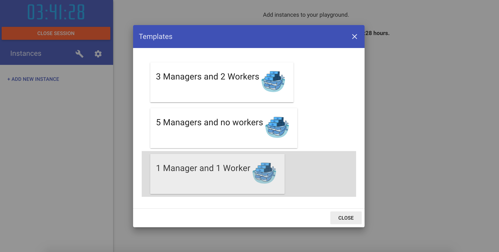
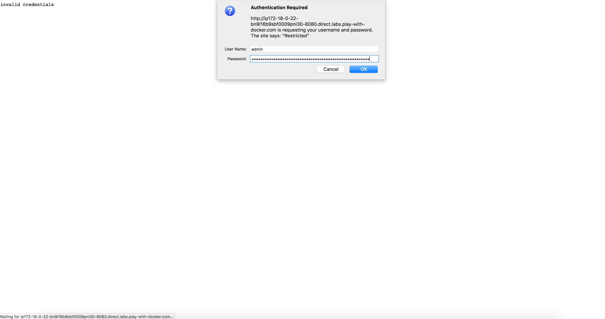
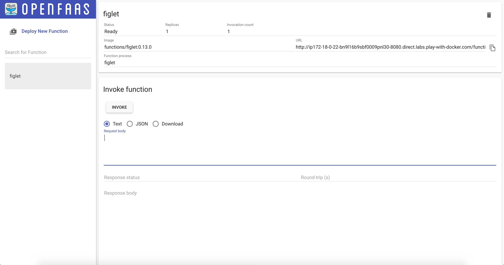
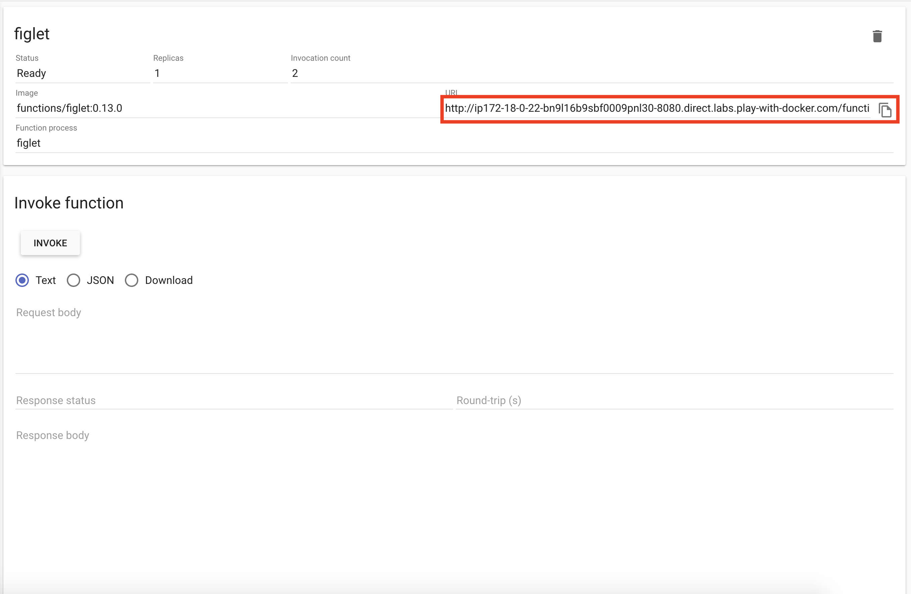

# OpenFaas Serverless Functions

## Install on Play with Docker

Start with no instances.  If any instances exist you should delete them


Click on the "wrench" icon and create a new swarm with with 1 manager and 1 worker node.




Deploy an OpenFaas stack by running the following command on the manager1 terminal.

```bash
git clone https://github.com/openfaas/faas && \
  cd faas && \
  ./deploy_stack.sh
```


Copy the generated admin password in the console. 


Open port `8080`.  You will be presented with a basic authorization dialog.  Enter username: admin and paste the password that you copied from the previous step




You should now see the OpenFaas Dashbord.


Deploy the Figlet function by clicking `Deploy New Function`.  Then select Figlet and the deploy button.


Congratualations!  You've deployed your first serverless function.



Test out your function, copy the url of your new function.



Now use your function, paste the following command in any terminal. Replace `<username>` with your Github username and `<url>` with the url you copied in the previous step.

`curl -d "<username>" <url>`

