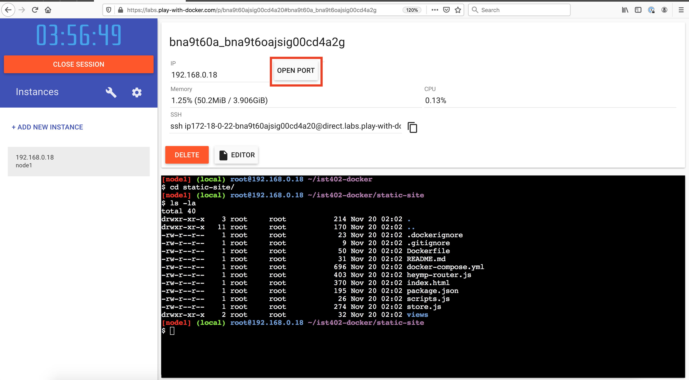
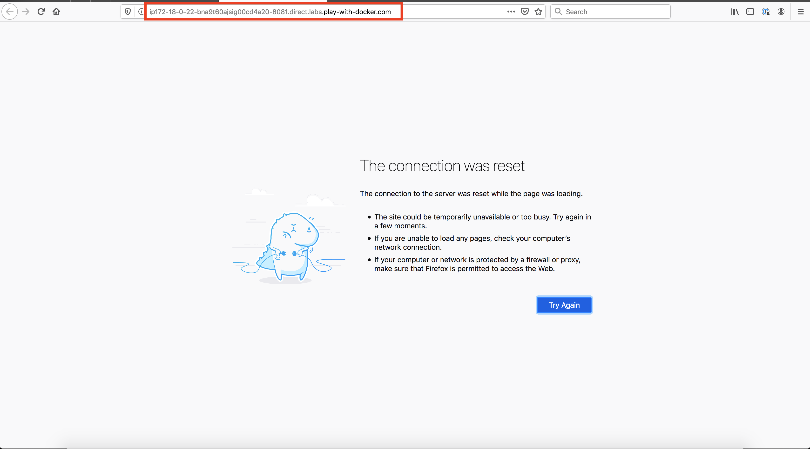
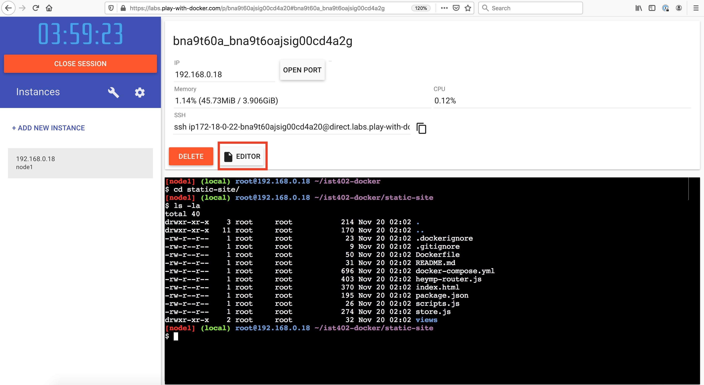
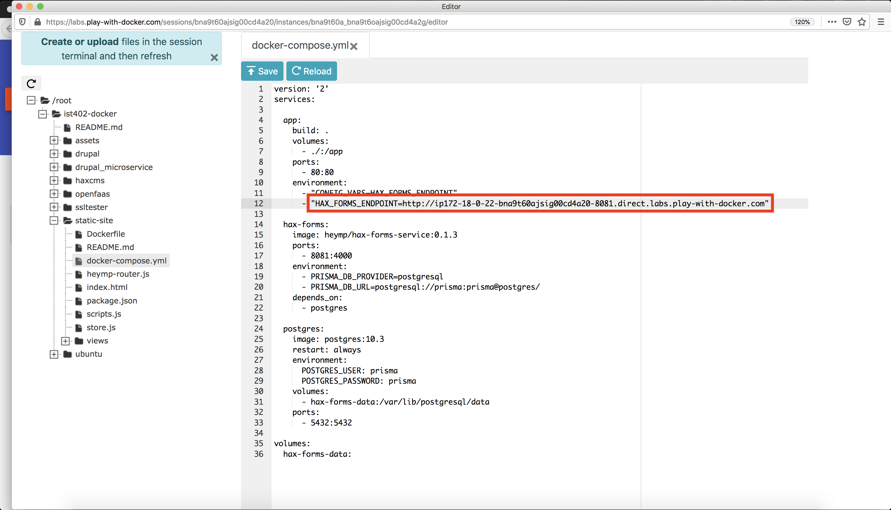
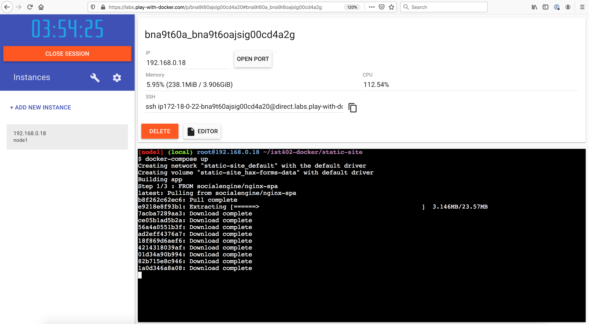
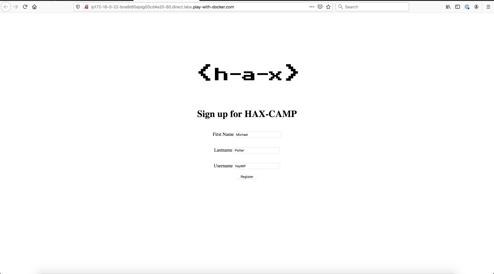
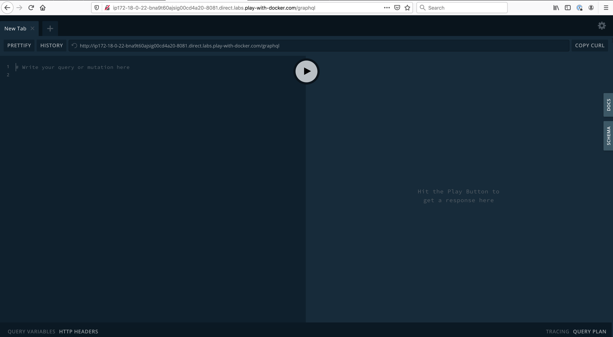
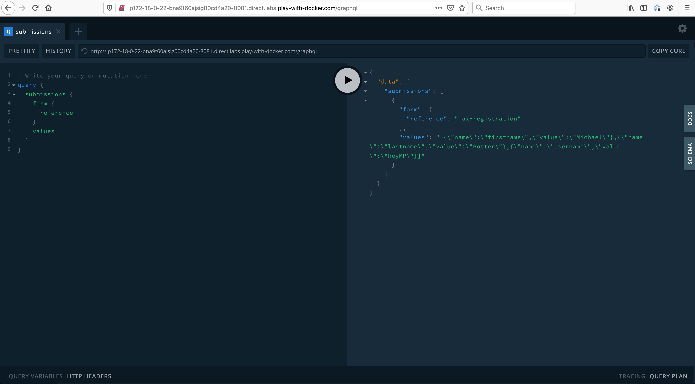

# Static Site w/ HAX Forms Microservice

This demo shows how microservices add dynamic functionality to a static website.


Change directories into the static-site directory.

```bash
cd static-site && ls -la
```


Before we spin up the website, we first need to generate the url of our microservice and add it to our application. To do this, click on the `Open Port` button.



In the dialog, enter port number `8081` and click ok.


This will open a new tab with a webpage that doesn't resolve because our application isn't running yet.

Copy the url and close the tab.



Now open the editor.



Navigate to the docker-compose.yml file located on `/root/ist402-docker/static-site/docker-compose.yml`.


Paste your url copied from the previous steps into the environment variable `HAX_FORMS_ENDPOINT`. Save the file change by clicking the `Save` button and close the editor.



Now we can finally start our application. Run the following command to start our project.

```bash
docker-compose up
```



After the the application starts open port 80.


Let's test out our application. Fill out the registration form and click `Register`.



To see our submitted registration open port 8081 and travel to the `/graphql` page. You should see the GraphQL sandbox.



In the left side portion of the editor, paste in our query to list all of the available submissions. Then click the play button to run the query.

```
query {
  submissions {
    form {
      reference
    }
    values
  }
}
```

You should now see your registration! 🎉

